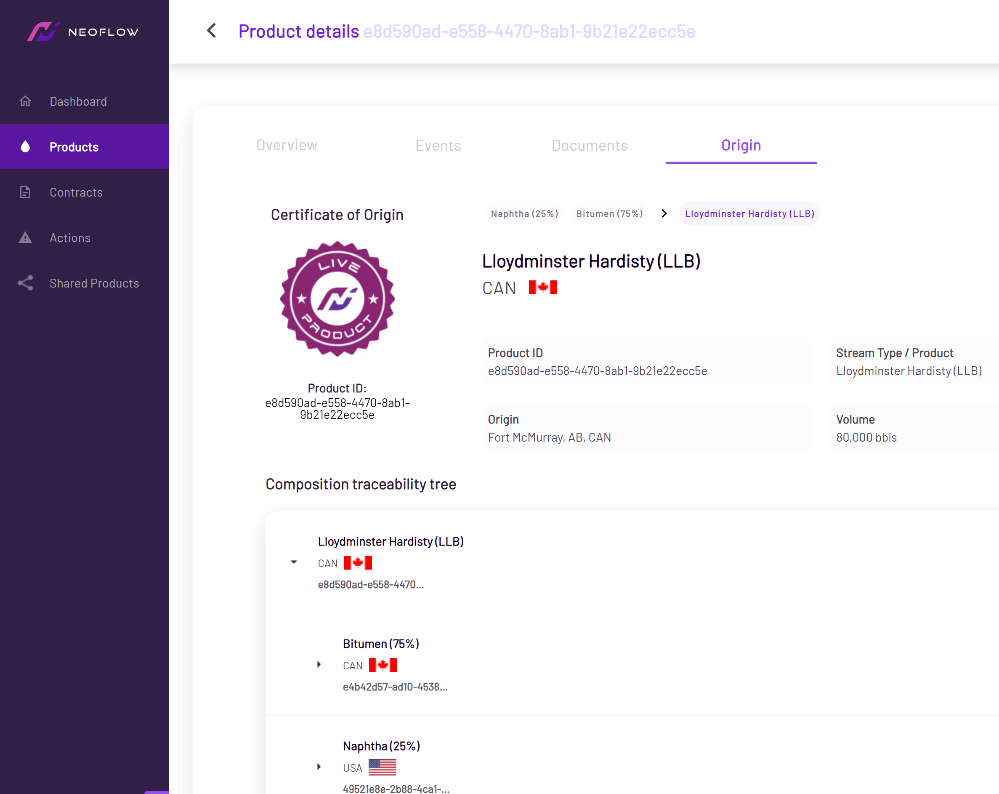

# Solution

Neoflow is a platform that allows users to create digital credentials of assets with verifiable and end-to-end information of lifecycle events, attributes, ownership, custody, origin and location. 

Relevant documentation in the value chain of a commodity, such as bills of lading, delivery tickets, certificates of origin, among others, are digitized to streamline data  exchange and automate regulatory and import reporting processes.

The following is a list of key features that support this solution. 

## Events

Neoflow is able to consume a subset of [GS1 EPCIS](https://www.gs1.org/standards/epcis) events in order to represent different supply chain events. These events are outlined below:

* Observation
* Transformation
* Aggregation
* Disaggregation
* Commission
* Decommission

These events are exposed as Verifiable Credentials that are self-issued by the event creator and are defined on the [Traceability-Vocab](https://github.com/w3c-ccg/traceability-vocab).

## Proof of Origin & Composition  

Production and transformation records are standardized and updated in real-time. Neoflow's underlying blockchain technology enables the creation of a trusted digital history that is attested by each party in the value chain and is impossible to forge. 

Each data element, timestamp and actor in the digital certificate of origin and composition has been cryptographically proven and can be easily verified by independent actors like customs, regulatory agencies and 3rd party auditors. 

### Certificate of Origin

The certificate of origin includes relevant product attributes such as HS code, physical and chemical product specifications, type of commodity, volume, among others. 

The lifecycle of the product is presented to outline its detailed composition from previous transformation events, along with details of the products that were used in its transformation. 

## Real-Time Analytics

The core functionality of Neoflow provides trusted real-time data. Coupled with analytics, this provides users with actionable insights such as:
* Evidence-based policy making
* Descriptive and predictive insights about supply and demand
* Detection and alerts of anomalies in real-time

### Details

Neoflow has pre-built dashboards that are customizable and provide granular data, specific to a user's value chain. In this way, visualizing and responding dynamically to events or alerts is easier and faster. 

